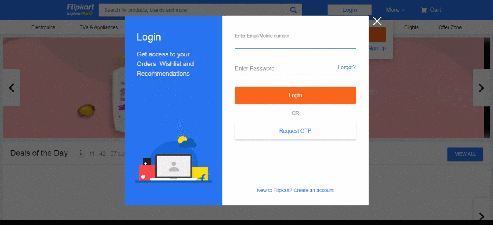
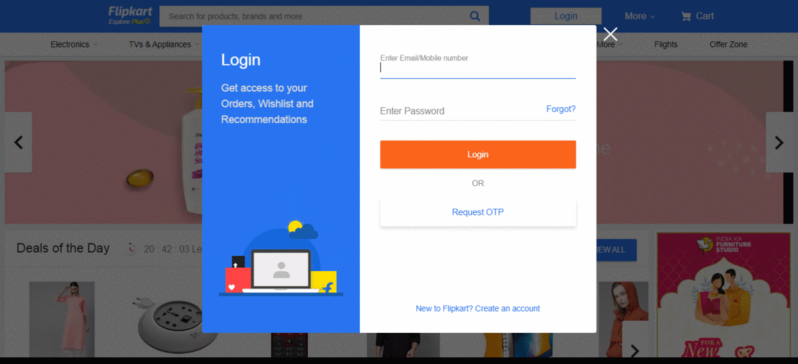

# Selenium-Testing
## url used: [Flipkart](https://www.flipkart.com/)

### This folder contains automation test code of flipkart.com.
#### **1. [FlipkartUI_Tesing.java](https://github.com/loydtellis/Selenium-Java/blob/main/Flipkart-UI-Testing/FlipkartUI_Tesing.java)**
##### Test case flow: 
##### open url> login using data from excel> find search button, enter Samsung > select a model, click > click 'Go to Cart'> verify clicked model and ordered model are same or not, if same click on 'Place Order'(But not complete the order process) else exit!

##### I recommend not to use the above program, beacuse if you look at [FlipkartUI_Tesing.java](https://github.com/loydtellis/Selenium-Java/blob/main/Flipkart-UI-Testing/FlipkartUI_Tesing.java) code I used is based on CSS Selector but the locators in the website are dynamic. Hence the attribute value are dynamic in nature and the code is not relaibale. So below is another selenium code same as above but with more reliable locators and values.
[FlipkartUI_Tesing_recommended.java](https://github.com/loydtellis/Selenium-Java/blob/main/Flipkart-UI-Testing/FlipkartUI_Tesing_recommended.java)

#### **2. [flipkart_hover.java](https://github.com/loydtellis/Selenium-Java/blob/main/Flipkart-UI-Testing/flipkart_hover.java)**
##### Test case flow:
##### open url> login using data from excel> hover on 'Electronics' , select a mobile model and click> click on 'view all' under Latest Samsung mobiles > click on bort by: Price -- High to Low > click on a mobile model> click 'Go to Cart'> click on 'Place Order'(But not complete the order process)

