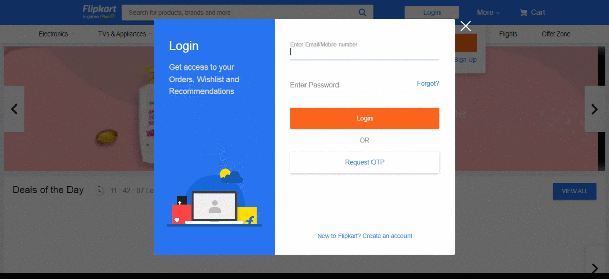

# Selenium-Testing

## url used: [Flipkart](https://www.flipkart.com/)

### This folder contains automation test code of flipkart.com.

#### Test case flow: 

##### open url> login using data from excel> find search button, enter Samsung > select a model, click > click 'Go to Cart'> verify clicked model and ordered model are same or not, if same click on 'Place Order'(But not complete the order process) else exit!

